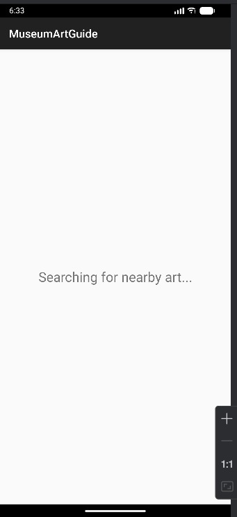
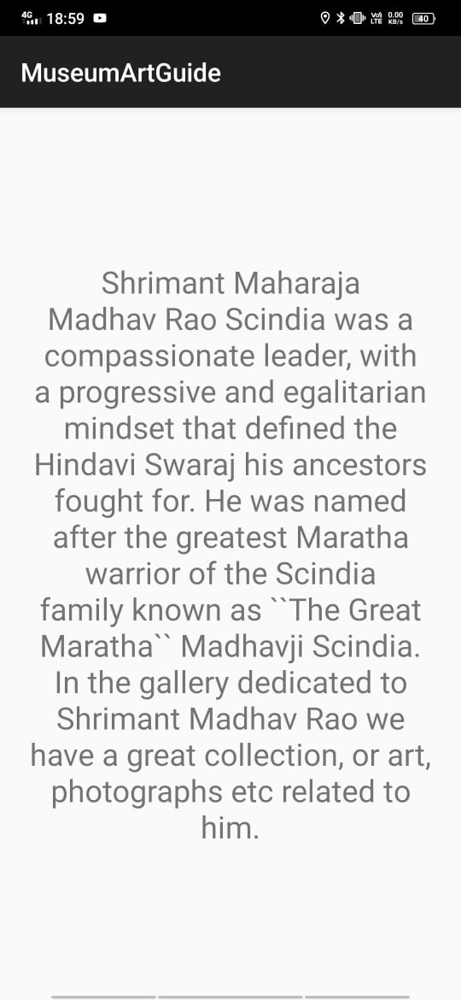
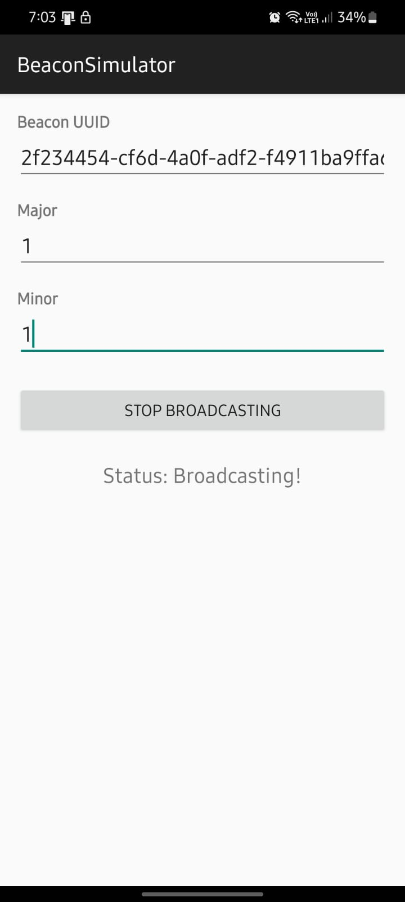
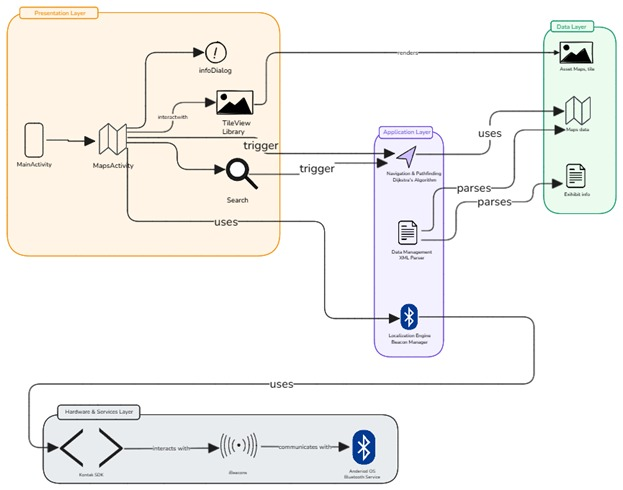

# MuseumArtGuide 🏛️📍

**A Smart, Location-Aware Museum Guide System powered by iBeacon Technology.**

MuseumArtGuide is an Android application designed to transform static museum visits into interactive experiences. By leveraging Bluetooth Low Energy (BLE) and iBeacon technology, the app automatically detects a visitor's proximity to an exhibit and delivers relevant, context-aware content directly to their mobile device.

This project acts as a bridge between the physical art and digital information, allowing users to focus on the exhibits rather than the technology.

---

## 📸 Application Screenshots

<p align="center">
  
  
  
</p>

---

## 🚀 Key Features

*   **Proximity Detection:** Automatically scans for nearby iBeacons using the AltBeacon library.
*   **Context-Aware Content:** Identifies specific art pieces based on Beacon UUID, Major, and Minor IDs.
*   **Smart Distance Zones:**
    *   *> 3 meters:* "Searching" or Preview mode.
    *   *< 3 meters:* Full-screen detailed exhibit mode.
*   **Beacon Simulator Companion:** Includes a separate utility app to broadcast custom iBeacon signals, allowing for development and testing without physical hardware.
*   **Robust Signal Handling:** Implements a grace period to prevent UI flickering caused by RSSI signal noise.
*   **Background Service:** (Planned/Implemented) Capable of scanning via foreground services to maintain engagement even when the app is minimized.

---

## 🏗️ System Architecture

The application follows a multi-layered architecture designed for scalability, modularity, and future navigation capabilities.



### Architectural Layers
1.  **Presentation Layer:** Handles the UI, including the `MainActivity`, interactive maps (vision), and Info Dialogs.
2.  **Application Layer:** The core logic containing the `Localization Engine` (BeaconManager), `Data Management` (Parsers), and `Navigation Algorithms` (Dijkstra).
3.  **Data Layer:** Manages assets, maps, and exhibit metadata.
4.  **Hardware & Services Layer:** Interfaces with the Android Bluetooth Stack and Kontakt SDK/AltBeacon to communicate with physical sensors.

---

## 🔄 Application Flow

1.  **Start:** App launches and requests Bluetooth/Location permissions.
2.  **Scan:** The `BeaconManager` begins active scanning for BLE advertisements.
3.  **Detect:** When a beacon is found, the app extracts the UUID, Major, and Minor values.
4.  **Filter:** The system calculates RSSI (Signal Strength) to determine the closest beacon.
5.  **Fetch:** The app queries the data source (Server or Local Cache) using the beacon IDs.
6.  **Display:** Relevant artwork history, images, and descriptions are rendered for the user.

---

## 🛠️ Tech Stack

*   **Language:** Java / Kotlin
*   **Platform:** Android SDK
*   **BLE Library:** [AltBeacon Android Beacon Library](https://altbeacon.github.io/android-beacon-library/)
*   **Network:** Volley Library (for fetching dynamic content)
*   **UI Components:** ConstraintLayout, CardView
*   **Architecture Pattern:** MVC / Layered Architecture

---

## 📲 How to Run

### Prerequisites
*   Android Studio
*   Two Android devices (One to run the Guide, one to run the Simulator) **OR** physical iBeacons.

### Installation
1.  Clone the repository:
    ```bash
    git clone https://github.com/viki-777/MuseumArtGuide.git
    ```
2.  Open the project in Android Studio.
3.  Sync Gradle to download dependencies (AltBeacon, Volley).

### Usage
1.  **Prepare the Beacons:**
    *   Install the **BeaconSimulator** app on a secondary device.
    *   Set the UUID, Major, and Minor (e.g., Major: 1, Minor: 1).
    *   Click "Start Broadcasting".
2.  **Run the Guide:**
    *   Launch **MuseumArtGuide** on your main device.
    *   Grant Location and Bluetooth permissions.
    *   Bring the devices close together.
    *   The screen will automatically update with the exhibit details corresponding to the broadcasted ID.

---

## 🔮 Future Roadmap

*   **Indoor Navigation:** Implementing the TileView library and Dijkstra’s algorithm for turn-by-turn wayfinding inside the museum.
*   **Offline Caching:** Migrating from network-only calls to a local Room database for full offline support.
*   **AR Integration:** Augmented Reality overlays when pointing the camera at an artwork.

---

## 📄 License

This project is open-source and available under the [MIT License](LICENSE).

---

